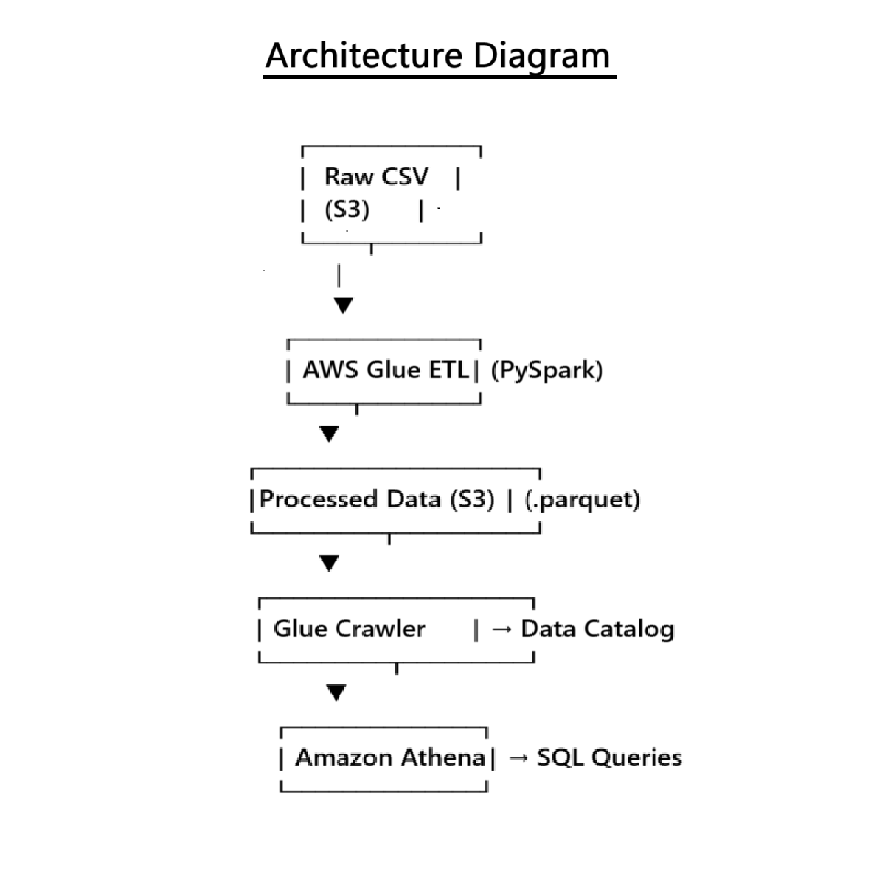
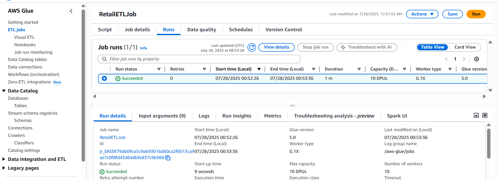
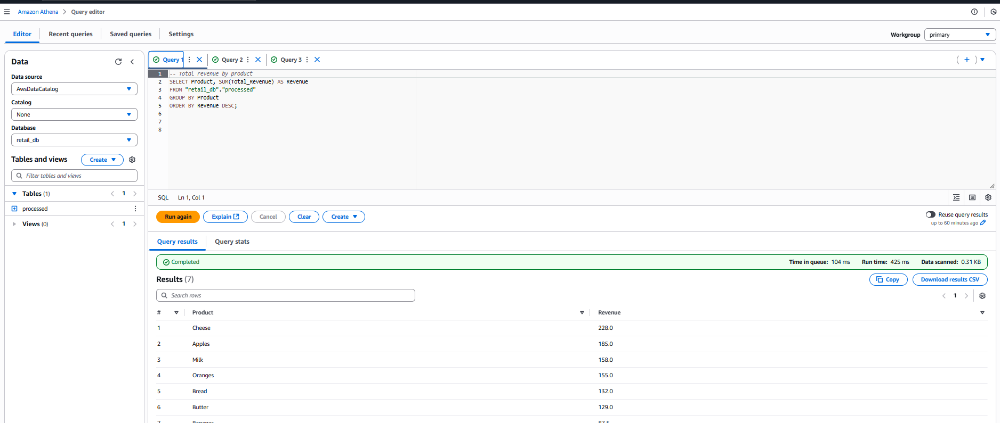
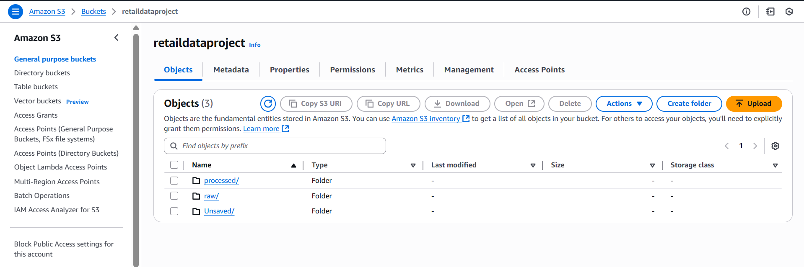

# AWS Retail Sales Analytics Pipeline

This project demonstrates a simple but complete **Data Engineering pipeline on AWS** for analyzing retail sales data, from raw ingestion to business insights.

## Tools & Technologies Used

- **Amazon S3** – Data storage (raw + processed)
- **AWS Glue** – ETL with PySpark (managed Spark)
- **AWS Glue Crawler** – Data cataloging
- **Amazon Athena** – SQL-based analytics
- **Parquet** – Columnar data format (processed output)


## 1. Business Understanding

The goal is to analyze daily retail sales to identify:
- Total revenue by product
- Sales trends over time

This helps stakeholders understand top-performing products and revenue trends and can help answer questions like:
> "Which product sells the most?"  
> "What days bring in the most revenue?"


## 2. Data Understanding

We use a CSV dataset containing  the following columns:

| Column          | Type     | Description                     |
|-----------------|----------|---------------------------------|
| `Date`          | Date     | Date of sale                    |
| `Store_ID`      | Integer  | Store identifier                |
| `Product`       | String   | Product name                    |
| `Quantity_Sold` | Integer  | Units sold                      |
| `Revenue`       | Float    | Revenue generated (USD)         |


**Location**: `s3://retaildataproject/raw/retail_sales_data.csv`


## 3. Data Preparation

**ETL (Extract-Transform-Load)** is done using a **PySpark** job in **AWS Glue**:
- Load raw CSV from S3
- Cast columns to correct data types
- Aggregate: revenue and quantity by product and date
- Save output to S3 in **Parquet format**

📂 Output location: `s3://retaildataproject/processed/`


## 4. Modeling

No machine learning involved — this project focuses on **data aggregation** and **exploratory data analysis** using SQL.


## 5. Evaluation

We use **Amazon Athena** to evaluate the aggregated data:

**Sample Queries**:

```sql
-- Total revenue by product
SELECT Product, SUM(Total_Revenue) AS Revenue
FROM retail_db.retail_sales_data
GROUP BY Product
ORDER BY Revenue DESC;

-- Daily revenue trend
SELECT Date, SUM(Total_Revenue) AS Daily_Revenue
FROM retail_db.retail_sales_data
GROUP BY Date
ORDER BY Date;
```


## 🧱 Architecture Diagram



## Few Screenshots

### Glue Job in AWS


### Athena SQL Output


### S3 Folder Structure



